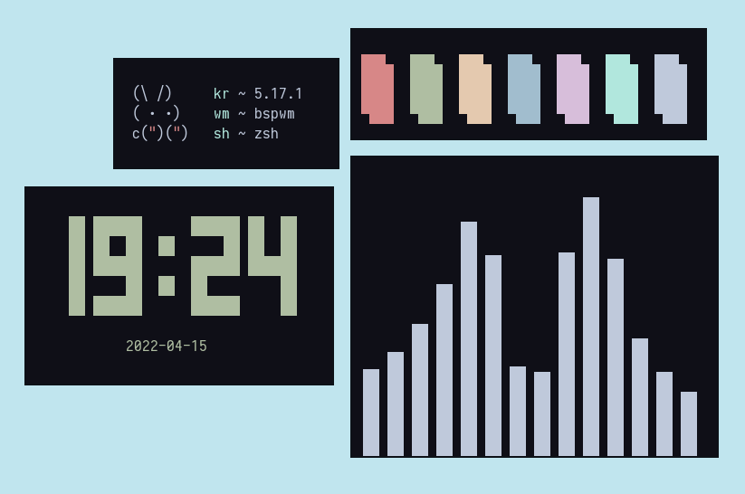

    
    <h1>Levuaska for Kitty</h1>
    
    

    
    <a href="https://github.com/levuaska/kitty/network/members/">
        
    
    

<h2>Installation</h2>
  
- Clone this repository
- Enter folder of clone
- Move `levuaska.conf` to `~/.config/kitty/kitty.conf`
  
<h2>Thanks<h2>

- [justleoo](https://github.com/justleoo)
